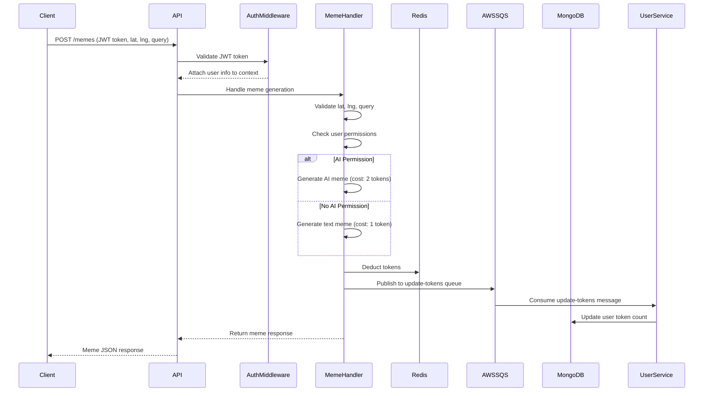

Here’s a revised and more structured version of your REST API description. I’ve clarified the flow, improved readability, and organized the details to make it easier for someone to understand:

---

### **REST API Overview**
I am building a REST API using the following technologies:
- **API Framework**: Go net/http
- **In-Memory Store**: Redis (Memorystore)
- **Database**: MongoDB
- **Pub/Sub System**: AWS SQS

The API will expose a `/memes` endpoint to handle meme generation. Below is the detailed flow and architecture.

---

### **API Flow**

#### **1. `/memes` Endpoint (POST)**
- **Request**:  
  A POST request to the `/memes` endpoint must include:
  - **Authorization Header**: A valid JWT token.
  - **Request Body**: JSON containing the following fields:
    - `lat` (float): Latitude.
    - `lng` (float): Longitude.
    - `query` (string): Search query for the meme.
---

#### **2. Auth Middleware**
- **Purpose**: Validate the JWT token and attach user information to the request context.
- **Flow**:
  1. Check if the `Authorization` header contains a valid JWT token.
  2. If the token is invalid or missing, return a `401 Unauthorized` response.
  3. If the token is valid, extract the user information (e.g., `username` and `permissions`) from the token claims and attach it to the request context.

---

#### **3. Meme Handler**
- **Purpose**: Handle meme generation based on user permissions and deduct tokens accordingly.
- **Flow**:
  1. Parse the request body to extract `lat`, `lng`, and `query`.
  2. Validate body. If `lat` is provided, `lng` must also be provided, and vice versa. Also validate that lat and lng are within the valid range.  If not, return a `400 Bad Request`.
  3. Check the user’s permissions from the request context:
     - If the user has the `ai` permission, generate an **AI-based meme** (cost: 2 tokens).
     - If the user does not have the `ai` permission, generate a **normal text meme** (cost: 1 token).
  4. Deduct the appropriate number of tokens from the user’s balance in Redis.
  5. Publish an event to the `update-tokens` queue (AWS SQS) to asynchronously update the user’s token count in MongoDB (the source of truth).
  6. If the meme is generated successfully, return a JSON response with the following structure:
     ```json
     {
       "text": "string representing the meme",
       "location": "text representation of the location derived from lat and lng"
     }
     ```

---

#### **4. User Service**
- **Purpose**: Manage user-related operations and handle token updates.
- **Functionality**:
  - **Listen to `update-tokens` Queue**:  
    Consume messages from the `update-tokens` queue (AWS SQS) and update the user’s token count in the MongoDB `users` collection.
  - **User Management Endpoints**:
    - **Create User**: Add a new user to the system.
    - **Modify Permissions**: Update a user’s permissions.
    - **Delete User**: Remove a user from the system.
    - **Update Token Count**: Directly modify a user’s token balance.

---

### **Mermaid Diagram**
Here’s a Mermaid diagram to visualize the flow:



---

### **Key Points**
1. **Authentication**: JWT tokens are validated by the Auth Middleware.
2. **Meme Generation**: Memes are generated based on user permissions, and tokens are deducted accordingly.
3. **Token Management**: Redis is used for fast token deductions, while MongoDB serves as the source of truth and is updated asynchronously via AWS SQS.
4. **User Management**: The User Service handles user-related operations and listens to the `update-tokens` queue.

---

This version is more structured and should be easier for others to understand. Let me know if you’d like further refinements!